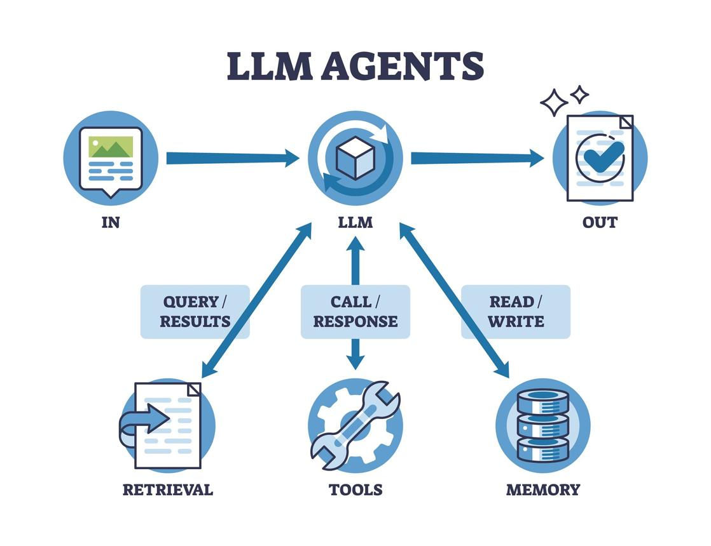

<div align="center">


# Devopstrio

**Enterprise Cloud &nbsp;&middot;&nbsp; AI &nbsp;&middot;&nbsp; DevOps Acceleration**

[](https://devopstrio.co.uk/)
[](https://github.com/orgs/devopstrio/repositories)
[](https://www.linkedin.com/company/devopstrioglobal/)
[](mailto:info@devopstrioglobal.com)
[](https://github.com/Devopstrio/.github/raw/main/assets/COMPANY_PROFILE.pdf)

<br/>

**Building the future of enterprise infrastructure &mdash; one blueprint at a time.**

180+ open-source accelerators &nbsp;&middot;&nbsp; 15 technology domains &nbsp;&middot;&nbsp; 3 cloud providers &nbsp;&middot;&nbsp; 100% production-grade

</div>

 

AgentGPT allows you to configure and deploy Autonomous AI agents.
Name your own custom AI and have it embark on any goal imaginable.
It will attempt to reach the goal by thinking of tasks to do, executing them, and learning from the results 🚀.

---

## ✨ Demo
For the best demo experience,

[Demo Video](https://github.com/reworkd/AgentGPT/assets/50181239/5348e44a-29a5-4280-a06b-fe1429a8d99e)


## 👨‍🚀 Getting Started

The easiest way to get started with AgentGPT is automatic setup CLI bundled with the project.
The cli sets up the following for AgentGPT:
The CLI automates the full deployment process, including:
- 🔐 **Environment Configuration**: Seamless setup of required API keys and environment variables.
- 🗂️ **Database Initialization**: Automatic provisioning of the MySQL database schema.
- 🤖 **Backend Services**: Rapid deployment of the FastAPI-powered orchestration layer.
- 🎨 **Frontend Interface**: Instant setup of the Next.js user interface.

## 🏗️ Architecture
Explore the core logic and architectural design of AgentGPT:

### 🔄 Multi-Agent Interaction
The core of AgentGPT is its ability to chain LLM calls to create an autonomous loop. It intelligently processes inputs, generates reasoning paths, and produces structured outputs.

<p align="center">
  
  <br>
  <em>LLM Agents Workflow</em>
</p>

### 📋 Task Management & Prioritization
Our agents don't just execute; they plan. The system maintains a dynamic task queue that is constantly re-prioritized based on the results of previous actions, ensuring the most efficient path to your goal.

<p align="center">
  
  <br>
  <em>Agent Task Prioritization and Execution Flow</em>
</p>

### 🏗️ System Architecture Overview
Built for scalability, the architecture integrates reasoning engines, tool hubs, and memory stores into a unified orchestrator, allowing for complex multi-agent deployments across enterprise applications.

<p align="center">
  
  <br>
  <em>Generic Agent Architecture Overview</em>
</p>


## Prerequisites :point_up:

Before you get started, please make sure you have the following installed:

- An editor of your choice. For example, [Visual Studio Code (VS Code)](https://code.visualstudio.com/download)
- [Node.js](https://nodejs.org/en/download)
- [Git](https://git-scm.com/downloads)
- [Docker](https://www.docker.com/products/docker-desktop). After installation, please create an account, open up the Docker application, and sign in.
- An [OpenAI API key](https://platform.openai.com/signup)
- A [Serper API Key](https://serper.dev/signup) (optional)
- A [Replicate API Token](https://replicate.com/signin) (optional)

## Getting Started :rocket:
1. **Open your editor**

2. **Open the Terminal** - Typically, you can do this from a 'Terminal' tab or by using a shortcut
   (e.g., `Ctrl + ~` for Windows or `Control + ~` for Mac in VS Code).

3. **Clone the Repository and Navigate into the Directory** - Once your terminal is open, you can clone the repository and move into the directory by running the commands below.

   **For Mac/Linux users** :apple: :penguin:
   ```bash
   git clone https://github.com/Devopstrio/agent-gpt.git
   cd agent-gpt
   ./setup.sh
   ```
   **For Windows users** :windows:
   ```bash
   git clone https://github.com/Devopstrio/agent-gpt.git
   cd agent-gpt
   ./setup.bat
   ```
4. **Follow the setup instructions from the script** - add the appropriate API keys, and once all of the services are running, travel to [http://localhost:3000](http://localhost:3000) on your web-browser.

Happy hacking! :tada:


## 🚀 Tech Stack

- ✅ **Bootstrapping**: [create-t3-app](https://create.t3.gg) + [FastAPI-template](https://github.com/s3rius/FastAPI-template).
- ✅ **Framework**: [Nextjs 13 + Typescript](https://nextjs.org/) + [FastAPI](https://fastapi.tiangolo.com/)
- ✅ **Auth**: [Next-Auth.js](https://next-auth.js.org)
- ✅ **ORM**: [Prisma](https://prisma.io) & [SQLModel](https://sqlmodel.tiangolo.com/).
- ✅ **Database**: [Planetscale](https://planetscale.com/).
- ✅ **Styling**: [TailwindCSS + HeadlessUI](https://tailwindcss.com).
- ✅ **Schema Validation**: [Zod](https://github.com/colinhacks/zod) + [Pydantic](https://docs.pydantic.dev/).
- ✅ **LLM Tooling**: [Langchain](https://github.com/hwchase17/langchain).


